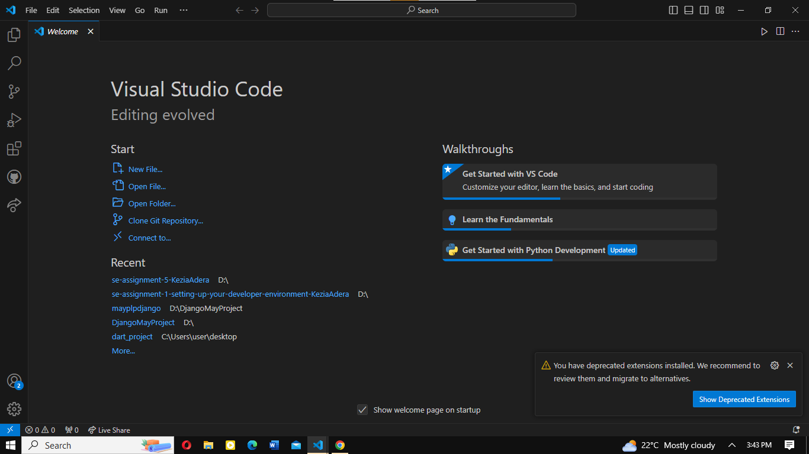
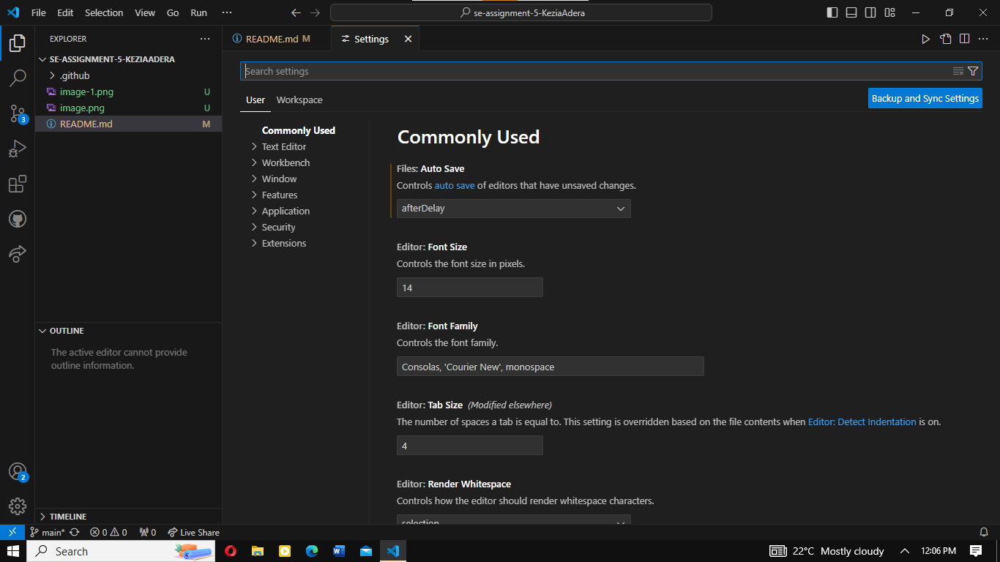
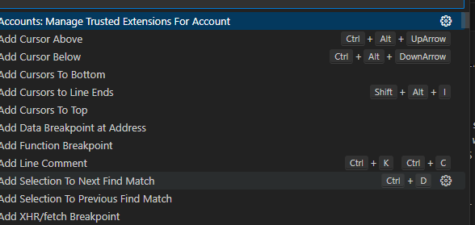
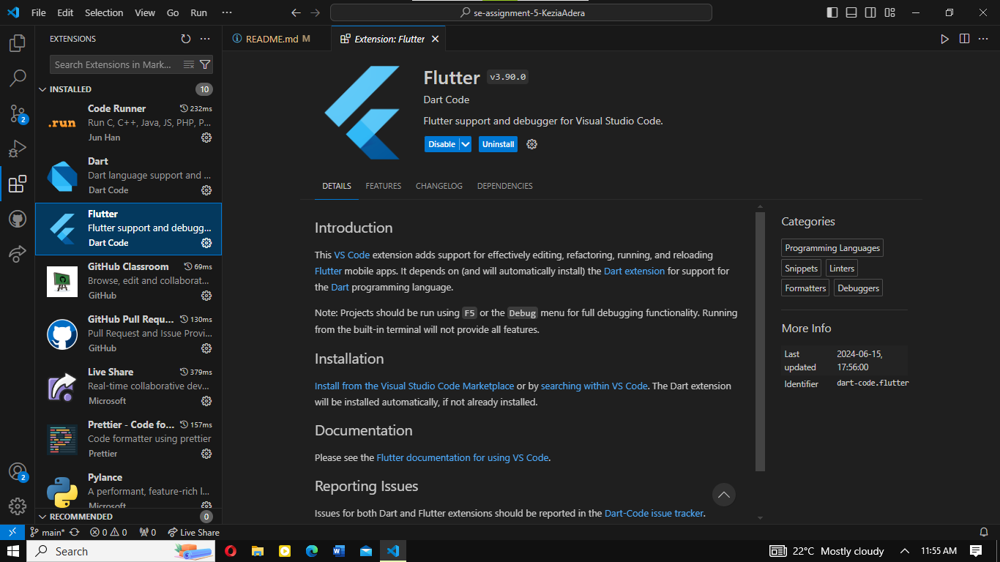
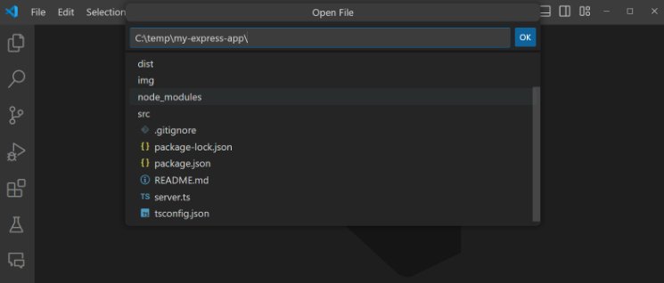

# SE-Assignment-5
Installation and Navigation of Visual Studio Code (VS Code)
 Instructions:
Answer the following questions based on your understanding of the installation and navigation of Visual Studio Code (VS Code). Provide detailed explanations and examples where appropriate.

 Questions:

1. Installation of VS Code:
   - Describe the steps to download and install Visual Studio Code on Windows 11 operating system. Include any prerequisites that might be needed.
Step 1: Visit the Official Website of the Visual Studio Code using any web browser like Google Chrome, Microsoft Edge, etc.
Step 2: Press the Download for Windows button on the website to start the download of the Visual Studio Code Application.
Step 3: When the download finishes, then the Visual Studio Code Icon appears in the downloads folder
Step 4: Click on the Installer icon to start the installation process of the Visual Studio Code.
Step 5: After the Installer opens, it will ask you to accept the terms and conditions of the Visual Studio Code. Click on I accept the agreement and then click the Next button.
Step 6: Choose the location data for running the Visual Studio Code. It will then ask you to browse the location. Then click on the Next button. 
Step 7: Then it will ask to begin the installation setup. Click on the Install button.
Step 8: After clicking on Install, it will take about 1 minute to install the Visual Studio Code on your device.

2. First-time Setup:
   - After installing VS Code, what initial configurations and settings should be adjusted for an optimal coding environment? Mention any important settings or extensions.
   Initial Configurations and Settings

User Settings:
Access the settings by clicking on the gear icon in the lower left corner and selecting Settings, or by pressing Ctrl+,.

Key Settings to Adjust:
Font Size and Family:
j
"editor.fontSize": 14,
"editor.fontFamily": "Fira Code, Consolas, 'Courier New', monospace"

Tab Size and Format on Save:
"editor.tabSize": 4,
"editor.insertSpaces": true,
"editor.formatOnSave": true

Line Numbers and Word Wrap:
"editor.lineNumbers": "on",
"editor.wordWrap": "on"

Minimap:
"editor.minimap.enabled": true

Auto Save:
"files.autoSave": "afterDelay",
"files.autoSaveDelay": 1000

Theme and Icon Theme:
Select a theme from the settings menu or through the command palette (Ctrl+Shift+P -> Preferences: Color Theme).
Choose an icon theme from the command palette (Ctrl+Shift+P -> Preferences: File Icon Theme).
Extensions to Install:

Language Support: Install language-specific extensions for syntax highlighting, IntelliSense, and debugging.

Python: Python by Microsoft
JavaScript/TypeScript: ESLint, Prettier - Code formatter
C++: C/C++ by Microsoft
Java: Java Extension Pack
Code Formatting:

Prettier - Code formatter: Auto-formats code according to specified styles.
ESLint: Integrates ESLint for JavaScript and TypeScript linting.
Version Control:

GitLens: Enhances the built-in Git capabilities with additional features like blame, history, and code authorship.
GitHub Pull Requests and Issues: Integrates GitHub pull requests and issues into VS Code.
Productivity:

Live Server: Launch a local development server with live reload for static and dynamic pages.
Bracket Pair Colorizer: Adds matching bracket colors for easier code navigation.
Path Intellisense: Provides path auto-completion in VS Code.
Code Spell Checker: Catches common spelling errors in code.
Debugging:

Language-specific debuggers are often included with language extensions (e.g., Python extension includes the Python debugger).

Other additional useful settings include:

Terminal Integration:File Exclusion,Keyboard Shortcuts and, Workspace Settings:

3. User Interface Overview:
   - Explain the main components of the VS Code user interface. Identify and describe the purpose of the Activity Bar, Side Bar, Editor Group, and Status Bar.

   Activity Bar: Provides quick access to different functional areas.Located on the far left-hand side. Users can switch between views and gives you additional context-specific indicators, like the number of outgoing changes when Git is enabled. You can change the position of the Activity Bar

Side Bar displays detailed content of the selected activity (e.g., file explorer, search results).Contains different views like the Explorer to assist you while working on your project.

Editor Group which is the main area for writing and editing code.The main area to edit your files. You can open as many editors as you like side by side vertically and horizontally.

The status bar shows status information and shortcuts to various actions and settings.Information about the opened project and the files you edit.
 

4. Command Palette:
   - What is the Command Palette in VS Code, and how can it be accessed? Provide examples of common tasks that can be performed using the Command Palette.

   To accessing the Command Palette, Press Ctrl+Shift+P (Windows/Linux) or Cmd+Shift+P (Mac).
It can also be accesed  from the menu by selecting View and clicking on the  Command Palette.

Some of the common tasks performed using the command palette include: 

Changing the Color Theme:
Click on Preferences, then Color theme to switch between different color themes to change the appearance of the editor.

Installing Extensions:
Click on extensions to search and install extensions directly from the VS Code marketplace.

To format Code, click on the command to automatically format the entire document according to the configured code style.

Running a Debug Session, click on the command debugg to start a debugging session based on the configuration in your launch.json file.

To execute Git Commands such as  Git: Clone, Git: Commit, Git: Push to perform various Git operations such as cloning repositories, making commits, and pushing changes to remote repositories.

Using the Command Palette, one can open the command palette, start typing the name of the command you want to execute, and select it from the list. For example, typing >Format Document will show the command to format the current file.

Opening Settings:
Command: Preferences: Open Settings
Open the settings to configure VS Code preferences.

Opening a Terminal:
Command: Terminal: Create New Integrated Terminal
Open a new integrated terminal within VS Code.
Toggling the Side Bar:

Command: View: Toggle Side Bar Visibility
Show or hide the Side Bar.
Quickly Navigating Files:

Command: Go to File...
Quickly open any file in your workspace by typing its name.
Searching for Symbols:

Command: Go to Symbol in Workspace... or Go to Symbol in File...
Quickly navigate to functions, classes, variables, and other symbols in your codebase.
Running Tasks:

Command: Tasks: Run Task
Execute predefined tasks such as build scripts, test commands, or any custom tasks defined in tasks.json.
Viewing Command History:

Command: Show All Commands
View a list of all available commands and access recently used commands.
Snippets:

Command: Insert Snippet
Insert code snippets to speed up coding by using predefined templates.
Managing Extensions:

Commands: Extensions: Show Installed Extensions, Extensions: Disable Extension, Extensions: Enable Extension
Manage installed extensions, enabling or disabling them as needed.

5. Extensions in VS Code:
   - Discuss the role of extensions in VS Code. How can users find, install, and manage extensions? Provide examples of essential extensions for web development.
VS Code extensions play an impoertant role in making it easier for users to add languages, debuggers, and tools to your installation to support your development workflow

Role of Extensions in VS Code
Extensions play a crucial role in Visual Studio Code (VS Code) by enhancing its functionality and enabling customization to meet specific development needs. They provide additional features, support for different programming languages, tools, and integrations that are not included in the core installation of VS Code.
Language Support: Extensions provide support for various programming languages, offering syntax highlighting, IntelliSense (code completion)and debugging capabilities.
Code Formatting and Linting:  help in maintaining code quality and consistency by providing automated code formatting and linting for example,extensions like Prettier and ESLint
Productivity Tools: Extensions  enhance productivity by offering live reloading, Git enhancements, and better code management for example GitLens
Themes and Customization: Users can personalize their editor's appearance by installing different color themes, icon packs, and other visual customizations.
Framework and Library Support: Extensions for specific frameworks and libraries (e.g., React, Angular, Vue.js) provide tailored support, including snippets, commands, and configurations.

To find extensions,click on the extensions icon,in the Activity Bar on the side of the windowUse the search bar to find extensions by name, keyword, or category.To
 To install, visit the VS Code Marketplace in a web browser to browse and search for extensions.Click the Install button next to the extension's name. This will open VS Code and prompt you to install the extension.

To manage Extensions, view the Installed Extensions:
Go to the Extensions view, click on the Installed tab to see all installed extensions.

To disable and enable extensions:
Right-click on an extension in the installed tab and select disable or enable.

Uninstalling Extensions:
Right-click on an extension in the installed tab and select Uninstall.

Update of extensionns are ususlaly automatic by default, though you can manually update them, by clicking on the update button next to the extension in the installed tab.

Some of the essential extensions for web development include:

JavaScript/TypeScript:
To integrates ESLint into VS Code for JavaScript and TypeScript linting.

Prettier - Code formatter: An opinionated code formatter that supports multiple languages.

HTML CSS Support: Enhances HTML and CSS support with auto-completion, class and id validation, and more.
CSS Peek: Allows you to peek at CSS definitions directly from your HTML files.

Live Server: Launches a local development server with live reload feature for static and dynamic pages.
Frameworks:

React:
ES7+ React/Redux/React-Native snippets: Provides snippets for common React patterns.
React Native Tools: Adds debugging and development support for React Native projects.
Angular:
Angular Essentials (by John Papa): A collection of extensions for Angular development.
Angular Language Service: Offers Angular templates, auto-completion, and error checking.
Vue.js:
Vetur: Provides Vue.js support with IntelliSense, snippets, and formatting.
Vue VSCode Snippets: Adds Vue.js code snippets.
Version Control:

GitLens: Enhances Git capabilities with features like blame, history, and repository insights.
GitHub Pull Requests and Issues: Integrates GitHub pull requests and issues directly into VS Code.
Productivity:

Path Intellisense which auto-completes filenames in your project.
Bracket Pair Colorizer which adds matching bracket colors to make code more readable.
Code Spell Checker which checks for spelling errors in code and comments.

6. Integrated Terminal:
   - Describe how to open and use the integrated terminal in VS Code. What are the advantages of using the integrated terminal compared to an external terminal?
   To start, open VS Code and navigate to the menu bar at the top.
   select the "View" option and then click on "Terminal".
   Once the terminal window appears, you can start using it to run commands and scripts in various languages such as Bash, Python, JavaScript, Java, TypeScript, and more. Whether you're working with APIs, managing GitHub repositories, or executing CLI commands, the integrated terminal in VS Code provides a seamless environment for your development tasks.

Advantages of using the intergrated terminal compared to an external terminal
- It's conveniently located within the VS Code interface, allows the user to work without switching between different applications.(Seamless intergration)
- Workspace awareness: The integrated terminal automatically starts in the root of your workspace, makes it easier to run commands specific to your project.
-Customization: One can customize the terminal's appearance, behavior, and shortcuts to suit your preferences.
-Split panes: You can split the terminal into multiple panes, allowing you to see different outputs at the same time.
-Using the integrated terminal can streamline your workflow and improve productivity by keeping everything in one place

7. File and Folder Management:
   - Explain how to create, open, and manage files and folders in VS Code. How can users navigate between different files and directories efficiently?
   On the VS code, hold Ctrl and press the tab to view a list of all files open in an editor group,
   To open the file again press on tab and click on the file you want to navigate, then realease ctrl to open it
   Similarly, one can use  the simple file dialog for opening and saving files and folders with a simpler Quick Pick dialog within VS Code. Once  you enable the Simple File Dialog, you can browse and select files and folders by using a Quick Pick inside VS Code.

8. Settings and Preferences:
   - Where can users find and customize settings in VS Code? Provide examples of how to change the theme, font size, and keybindings.
   Step 1: Open the settings editor, Click on file, go to Preferences, then click on settings.
   For more advanced users, settings can be edited directly in the settings.json file

   To change the theme. go to settings 
Search for Color Theme.
Select a theme from the dropdown menu.

To change the font size go to settings,
Search for Font Size.
Adjust the value in the Editor to the  Font Size setting that you prefer.

To customizing keybindings, go to the Keybindings UI:
Open the Keybindings editor by clicking the gear icon and selecting Keyboard Shortcuts, or press Ctrl+K Ctrl+S.
You can search for specific commands and assign new keybindings by clicking on the pencil icon next to the command and pressing the desired key combination.

9. Debugging in VS Code:
   - Outline the steps to set up and start debugging a simple program in VS Code. What are some key debugging features available in VS Code?
   In setting Up and Starting Debugging,Open VS Code:
Click to open or create a new  Project:
In case you have an existing project, Go to File , then click on open folder and select your project directory,
Install the language support extension you want to work with for example, python, javascript, (this can be found on Vs Code marketplace)
Step 2: Create a new file with the appropriate extension for your programming language (e.g., app.py for Python, app.js for JavaScript).
Step 3: To add Debug Configuration:
Clicking on the Debug icon in the Activity Bar on the side of the window or by pressing Ctrl+Shift+D.
Click on the gear icon to open the launch.json file and select the environment you are debugging (e.g., Node.js, Python). 
VS Code will create a launch.json file with default configuration settings.
For example:Example of a launch.json for a Python program:
Set Breakpoints:
Step 4: Click in the gutter (the left margin) next to the line numbers in your source code where you want to add breakpoints. A red dot will appear to indicate a breakpoint.
Step 5: Start Debugging: go to the Debug view and click the green play button to start the debugging session. VS Code will run your program and stop at the breakpoints you’ve set.

10. Using Source Control:
    - How can users integrate Git with VS Code for version control? Describe the process of initializing a repository, making commits, and pushing changes to GitHub.
    Prerequisites include:
    Install Git: Ensure Git is installed on your system. You can download it from git-scm.com.
Install VS Code: Download and install Visual Studio Code 
Setting Up Git in VS Code
Step 1: Open VS Code:
Step 2: Open a Folder:
Step 3: Open the project folder you want to work with. Go to File > Open Folder and select your project directory.
Step 4: Open the integrated terminal in VS Code by navigating to View > Terminal or pressing Ctrl+`.
Initialize a new Git repository with the following command:
git init
This command creates a new .git directory in your project, setting it up as a Git repository.
Configure Git (Optional):
Set your user name and email if you haven’t already
git config --global user.name "Your Name"
git config --global user.email "your.email@example.com"
Making Your First Commit
Stage Changes:

In the VS Code sidebar, click on the Source Control icon (or use the shortcut Ctrl+Shift+G).
You will see the changes listed under "Changes". To stage these changes, click the + icon next to each file or click the + icon in the header to stage all changes.
Commit Changes:

After staging the changes, you can make a commit. Enter a commit message in the message box at the top of the Source Control panel.To commit changes:
git commit -m "Your commit message"
To add to a remote repository:
git remote add origin
Click on the checkmark icon or press Ctrl+Enter to commit the staged changes.
Pushing Changes to GitHub
Create a GitHub Repository:Go to GitHub and create a new repository.
To add to a remote repository:
git remote add origin 
To push changes to github, write the command:
git push -u origin master

References:
https://www.geeksforgeeks.org
https://code.visualstudio.com
https://www.studocu.com/

 Submission Guidelines:
- Your answers should be well-structured, concise, and to the point.
- Provide screenshots or step-by-step instructions where applicable.
- Cite any references or sources you use in your answers.
- Submit your completed assignment by 1st July 

